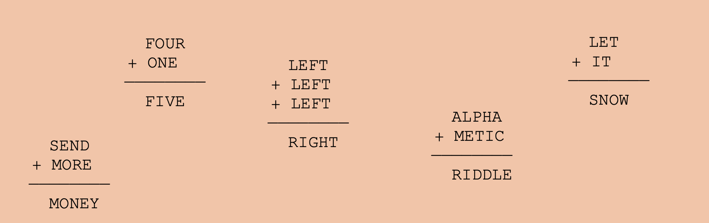

<h1>Alphametic riddle solver</h1>
<i>Published on: Monday, 06.12.2023 </i>
<i>Languages: Java </i>
<i>Version: 1.0 </i>
 

[Get Documentation](documents/AlphameticRiddleSolverInformation.pdf)

This is the first program, that I've written even before university. It solves an alphametic math riddle, consisting of three variables: v1, v2 and the solution. It does not support more variables! (see constructor).

Here's an example of an alphametic riddle:

<code>SEND + MORE = MONEY</code>

To solve those puzzles correctly, we have to follow a certain set of rules:

<ol>
    <li><b>Every letter type can only be assigned to one specific digit, and vice versa</b></li>
     
    <li><b>The digits need to range between 0 and 9</b></li>
     
    <li><b>The first letter of each word in the equation cannot be zero</b></li>
</ol>

For our given puzzle, the correct solution would be:

<code>9567 + 1085 = 10652</code>

To solve these puzzles, the program uses two Strings:

<code>private String characters = "";</code>
 
<code>private String numbers = "";</code>

The String <code>characters</code> holds all the letters from this puzzle. For our example, it would be: characters = <code>"SENDMORY"</code>. The String <code>numbers</code> distribute the digits to the letters numbers = <code>"10234567"</code>. The numbers are distributed according to the rules above.

Now the software forms the numbers according to the two String variables. If the solution is correct, it'll be passed to the console. If not, a normal number will be made out of the numbers-String and raised by one until, there are no duplicate digits in the String or any first letter has now zero assigned. This happens, until all digits of this number have a value of 9.
